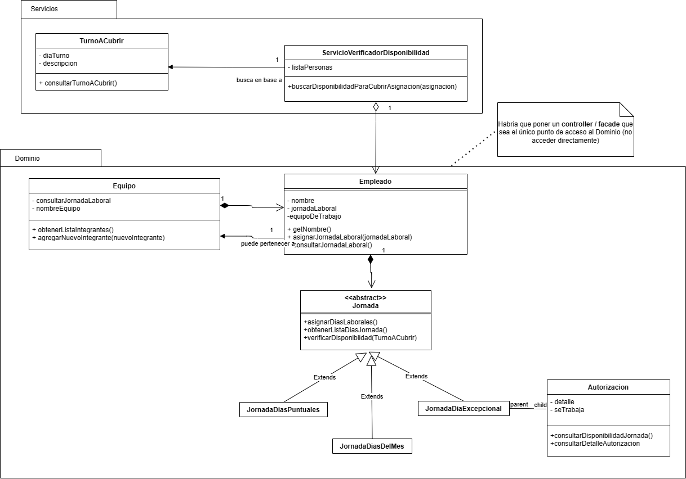
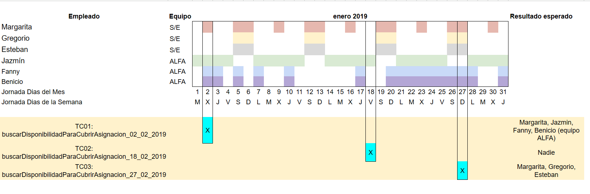
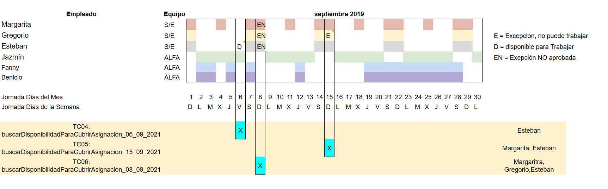

# Verificador Agenda de Disponibilidad

Proyecto JAVA con REST API y Frontend Next.js para verificar disponibilidad de empleados.

## 🎯 Proyecto

- **Backend**: Java Spring Boot REST API (Puerto 8080)
- **Frontend**: Next.js 16 React Application (Puerto 3000)
- **Orquestación**: Docker Compose para ambos servicios

### Características

✅ Sistema automatizado de verificación de disponibilidad de empleados
✅ REST API completamente documentada con OpenAPI/Swagger
✅ Frontend minimalista y amigable con el usuario
✅ Docker support con docker-compose
✅ Pruebas unitarias e integración
✅ Despliegue en contenedores

## 📋 Tabla de Contenidos

- [Quick Start](#quick-start)
- [Architecture](#architecture)
- [Backend](#backend)
- [Frontend](#frontend)
- [Docker](#docker)

## 🚀 Quick Start

### Docker Compose (Recomendado)

```bash
# Construir y ejecutar ambos servicios
docker-compose up

# Acceder a:
# Frontend: http://localhost:3000
# API: http://localhost:8080
# Swagger: http://localhost:8080/swagger-ui.html
```

### Desarrollo Local

**Backend**:
```bash
mvn clean package -DskipTests
java -jar target/VerificadorDisponibilidad-1.0-SNAPSHOT.jar
# http://localhost:8080
```

**Frontend**:
```bash
cd frontend
npm install
npm run dev
# http://localhost:3000
```

## 🏗️ Architecture

```
┌─────────────────────────────────────────────────────────────┐
│                        Docker Network                       │
├──────────────────────┬───────────────────────────────────────┤
│   Frontend (3000)    │            API (8080)                 │
│  ┌─────────────────┐ │  ┌──────────────────────────────┐    │
│  │   Next.js App   │ │  │  Spring Boot REST API        │    │
│  │ (React + TS)    │◄──┤                              │    │
│  │                 │ │  │  - Health Check             │    │
│  │ - Form Input    │ │  │  - Availability Check       │    │
│  │ - Results Disp. │ │  │  - API Info                 │    │
│  │ - Status Indic. │ │  └──────────────────────────────┘    │
│  └─────────────────┘ │                                       │
└──────────────────────┴───────────────────────────────────────┘
```

## 📚 Backend

### Proyecto Consiga

Modelar una solución OOP para verificar disponibilidad de empleados considerando:

### Condiciones para la resolución:
Modelar una solución Orientada a Objetos

Se recomienda desarrollarlo usando TDD

No es necesario implementar persistencia, ni interfaz de usuario. Alcanza con los tests necesarios para verificar que la funcionalidad está correctamente implementada.

### Parte 1

Últimamente estamos teniendo problemas de staffing en nuestras sucursales, nosotros siempre tuvimos como política: horarios flexibles a medida que la persona lo necesite.  Esto siempre lo logramos respetando las disponibilidades de nuestros empleados.

También con el pasar del tiempo nos dimos cuenta de que hay personas que funcionan mejor como un equipo y una vez que logramos armar equipo tomamos como política: equipo que funciona no se toca. Con lo cual los equipos se asignan en conjunto o no se asignan en absoluto. La disponibilidad de un equipo es la consecuencia de las disponibilidades de sus integrantes, es decir un equipo puede cubrir el turno de un día determinado (por ejemplo, el 02/01/2019) si y sólo si todos sus integrantes pueden.

El tema es que estamos creciendo, y lo que antes era simple porque éramos pocos y nos conocíamos, ahora ya no lo es y se cometen muchos errores a la hora de asignar los horarios. Ya perdimos varias personas clave para nosotros por esto y no puede seguir pasando así que necesitamos que nos ayudes a desarrollar un sistema que automatice la respuesta a la pregunta ¿Quienes estarían disponibles para cubrir la asignación?

Después de buscar varios ejemplos de disponibilidades notamos que muchas veces se caen en los siguientes patrones:
1. Fines de semana: Sábado y Domingo
2. Entre semana Lunes a Viernes
3. Día puntual (Martes, o Jueves)
4. Día del mes (1, 5 ó 10)

También, las disponibilidades suelen ser combinaciones de todas las situaciones anteriores, por ejemplo:
1. Margarita puede trabajar los Miércoles y los fines de semana, una disponibilidad combinada de día puntual y fin de semana
2. Gregorio y Esteban pueden trabajar solamente los fines de semana
3. Jazmín tiene disponibilidad de Lunes a Viernes, que se considera la disponibilidad default
4. Fanny y Benicio trabajan todos los jueves y los días 2, 3, 5, 7 y del 20 al 28, es decir una combinación de días puntuales y días del mes


### Parte 2

Nos dimos cuenta que hay algo que nadie avisa al principio pero que también se hace:
1. ¡Excepciones por días puntuales! En un principio, estaban resignados a hacerlo manualmente ya que en todas las sucursales tienen un cuaderno azul con pedidos de horarios, pero viendo todo lo que se podía hacer ¡nos pidieron que lo agreguemos!
2. Básicamente nos comentaron de que las excepciones son para especificar que ahora en una fecha puntual se tiene una cierta disponibilidad o que no se la tiene.


Esto pasa mucho por ejemplo durante las fiestas, independientemente los días que caiga Jazmín (como su familia es del Chaltén) va a pasar las fiestas allá con lo cual no puede trabajar desde el 23 de Diciembre hasta el 2 de Enero (a veces se toma vacaciones, pero otras veces no lo hace y le acomodan los horarios para que pueda hacer ese viaje, esto es una atención que se tiene con Jazmín porque tiene esa disponibilidad tan amplia).


No nos pidieron incluir en el sistema el criterio por el cual estos pedidos de excepciones se aprueban o no, pero si quieren que sea posible que una persona solicite una excepción, esa excepción sea aprobada o rechazada y en el caso de estar aprobada se respete para la asignación.

Les dejamos ejemplos de pedidos que vimos en el cuaderno azul:

1. Gregorio: no puedo trabajar el Domingo 10/09 (es el bautismo de mi sobrino y soy el padrino)
2. Comentario del gerente de sucursal: OK
3. Esteban: si necesitás el Miércoles 06/09 puedo venir (no tengo clases)
4. No tiene comentario del gerente porque cuando amplían la disponibilidad no suele haber problemas
5. Todos (escrito por cada uno): el viernes 08/09 queremos hacer un asado en lo de Jazmín
6. Comentario del gerente de sucursal: Chicos no podemos cerrar la sucursal, hablémoslo

## Class Diagram solution



## Test Scenarios





---

## 🎨 Frontend

Un frontend moderno y amigable para el sistema de verificación de disponibilidad.

### Características

- ✨ Interfaz limpia y minimalista
- 📱 Diseño totalmente responsivo
- ⚡ Validación de formularios en tiempo real
- 🧪 Pruebas unitarias completas (24+ tests)
- 🎯 Soporte para múltiples patrones de disponibilidad
- 🐳 Completamente containerizado

### Estructura de Carpetas

```
frontend/
├── src/
│   ├── app/
│   │   ├── layout.tsx       # Layout raíz
│   │   ├── page.tsx         # Página principal
│   │   └── globals.css      # Estilos globales
│   ├── components/          # Componentes React
│   │   ├── AvailabilityForm.tsx    # Formulario principal
│   │   ├── EmployeeInput.tsx       # Entrada de empleados
│   │   ├── ResultsDisplay.tsx      # Mostrar resultados
│   │   └── StatusCard.tsx          # Estado del servicio
│   ├── utils/
│   │   ├── api.ts          # Cliente API
│   │   └── validators.ts   # Validaciones
│   ├── types/
│   │   └── index.ts        # Tipos TypeScript
│   └── __tests__/          # Tests unitarios
├── Dockerfile
├── package.json
├── tsconfig.json
└── README.md
```

### Scripts Disponibles

```bash
# Desarrollo
npm run dev

# Producción
npm run build
npm start

# Testing
npm test                 # Ejecutar tests
npm run test:watch      # Modo watch
npm run test:coverage   # Reporte de cobertura

# Linting
npm run lint
```

### Variables de Entorno

```bash
# .env.local
NEXT_PUBLIC_API_BASE_URL=http://localhost:8080
```

Para Docker:
```bash
NEXT_PUBLIC_API_BASE_URL=http://api:8080
```

### Tipos de Disponibilidad Soportados

1. **Días Puntuales** (e.g., Lunes, Miércoles)
2. **Entre Semana** (Lunes a Viernes)
3. **Fines de Semana** (Sábado y Domingo)
4. **Días del Mes** (e.g., 1, 5, 10, 20)

### Flujo de Uso

1. Ingresar descripción del turno
2. Ingresar fecha del turno (DD/MM/YYYY)
3. Agregar empleados con sus disponibilidades
4. Hacer clic en "Verificar Disponibilidad"
5. Ver resultados con empleados disponibles

### Testing

```bash
# Ejecutar todos los tests
npm test

# Tests incluyen:
# - Validación de fechas
# - Validación de empleados
# - Validación de solicitudes
# - Integración con API
```

---

## 🐳 Docker

### Build y Run Individual

**Backend**:
```bash
docker build -t verificador-api:1.0 .
docker run -p 8080:8080 verificador-api:1.0
```

**Frontend**:
```bash
docker build -t verificador-frontend:1.0 ./frontend
docker run -p 3000:3000 -e NEXT_PUBLIC_API_BASE_URL=http://localhost:8080 verificador-frontend:1.0
```

### Docker Compose (Recomendado)

```bash
# Build and start both services
docker-compose up

# Build without cache
docker-compose up --build

# Run in background
docker-compose up -d

# View logs
docker-compose logs -f

# Stop services
docker-compose down
```

### Verificación de Servicios

```bash
# Frontend health
curl http://localhost:3000

# API health
curl http://localhost:8080/api/availability/health

# Swagger UI
open http://localhost:8080/swagger-ui.html
```

---

## 🔄 API Endpoints

### POST /api/availability/check

Verificar disponibilidad de empleados.

**Request**:
```json
{
  "turnoDescripcion": "Morning Shift",
  "turnoDia": "25/05/2026",
  "empleados": [
    {
      "nombre": "Juan",
      "equipo": null,
      "jornadas": [
        {
          "tipo": "dias_entresemana"
        }
      ]
    }
  ]
}
```

**Response**:
```json
{
  "availableEmployees": ["Juan"],
  "totalAvailable": 1,
  "timestamp": "2026-05-25T10:20:02.401+02:00",
  "shiftDetails": {
    "date": "25/05/2026",
    "description": "Morning Shift"
  }
}
```

### GET /api/availability/health

Estado del servicio.

**Response**:
```json
{
  "status": "UP",
  "service": "Availability Calendar API",
  "timestamp": "2026-05-25T10:20:02.401+02:00"
}
```

### GET /api/availability/info

Información de la API.

---

## 📋 Requisitos

- Node.js 18.0.0+
- Java 17+
- Docker & Docker Compose (opcional)

## 🛠️ Desarrollo

### Estructura del Proyecto

```
.
├── src/                    # Backend Java
├── frontend/               # Frontend Next.js
├── docker-compose.yml      # Orquestación
├── Dockerfile              # Backend Docker
└── README.md
```

### Git Workflow

```bash
# Crear rama de feature
git checkout -b feature/nextjs-frontend

# Hacer cambios y commit
git add .
git commit -m "feat: Add Next.js frontend"

# Push y crear PR
git push origin feature/nextjs-frontend
```

## 📄 Documentación

- [Frontend README](./frontend/README.md) - Documentación detallada del frontend
- [REST API Implementation](./REST_API_IMPLEMENTATION.md) - Documentación del backend
- [Class Diagram](./class_diagram.png) - Diseño de clases

## ✅ Status

- ✅ Backend REST API completo
- ✅ Frontend Next.js funcional
- ✅ Docker Compose working
- ✅ Todos los tests pasando
- ✅ Documentación completa

## 📞 Soporte

Para problemas o preguntas:
1. Revisar la documentación de cada componente
2. Verificar los logs: `docker-compose logs -f`
3. Revisar la consola del navegador (frontend)
4. Revisar el Swagger UI: http://localhost:8080/swagger-ui.html

---

**Versión**: 2.0.0 (con Frontend)  
**Última actualización**: 2026-05-25
